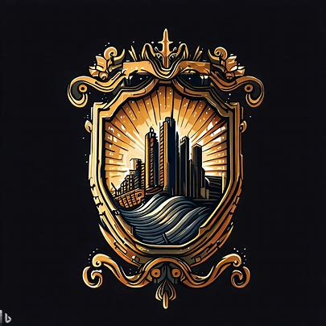

# 力量之城

1. 城邦名：巴尔杜克
2. 城邦主体种族：兽人
3. 城邦首都：巴尔，意为力量之地
4. 圣物：力量之石
5. 基座：法之塔
   1. 被称为勇者之巅
   2. 配对律法之城的法之眼
   3. 现被用于勇士训练场
6. 城邦文化：荣誉、战斗、实力至上、个人英勇
7. 城邦政体：
   1. 体制：战士议会制
   2. 领导人：首领克鲁格
   3. 统治阶层：战士、长老等逐层向下
8. 城邦接壤：律法之城、财富之城、自由之城、神迹之城、探索之城
9. 地形：力量之城的地形较为多样，西部是辽阔的平原，适合养殖和农业发展，而东部则有一些峻岭，为居民提供了居住和防御的天然屏障。
10. 城邦历史：
    1. 巴尔杜克的兽人一直崇尚力量，认为强者才有资格统治，而弱者只能臣服。因此，他们在公元89年创建了力量之城，以实力至上为核心理念。
    2. 公元121年，力量之城宣战律法之城，试图改变律法之城的秩序。
    3. 第127年：钢铁冲突 - 力量之城和自由之城发生短暂战争，最后达成和解。尽管力量之城一度处于优势，但最终在信仰之城和财富之城的调停下认输，归还土地。
    4. 自那次战争后，力量之城在国际事务中保持低调，专注于内部事务和贸易往来。力量之城与其他城邦保持着一定程度的友好关系，但也对它们的政策保持警惕。
    5. 第549年：掠夺远征 - 罪恶之城希望索求一块没有污染的徒弟，因此他们联合偶然联系上却意外合拍的腐化之城发动了一场偷袭
    6. 第560年：四城防线 - 律法之城、力量之城、礼教之城和财富之城联合起来
    7. 第587年：世界大战 - 在四城防线战争演变成全文明联合体的2年后。勇者联盟成功地保卫了这四个城邦的领土，并在战争结束后达成了一项长期的和平协议。这个联盟使得各城邦间的合作关系得以加强，进一步促进了文化、经济和军事方面的交流。

## 下位城邦

1. 战争之城：概念为勇武
   1. 位于宗教之城的西北方向
   2. 接壤宗教之城和自由之城。