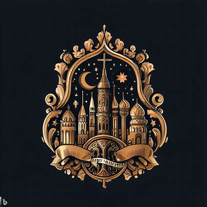

# 宗教之城

1. 城邦名：莫雷森卡萨
2. 城邦主体种族：人类
3. 城邦首都：莫雷，意为信仰之地
4. 圣物：信仰之心
5. 基座：信仰之塔
   1. 被称为神光圣殿
   2. 配对宗教之城的信仰之心
   3. 现被作为神庙使用
6. 城邦文化：虔诚、神秘、包容、对异端持严格审查态度
7. 城邦政体：
   1. 体制：神权制
   2. 领导人：大祭司克拉拉
   3. 统治阶层：神官、祭司等逐层向下
8. 城邦接壤：力量之城、宗教之城、敬仰之城、腐化之城
9. 地形：宗教之城地势较高，有许多险峻的山脉和高耸入云的山峰。然而，在山谷之间却隐藏着肥沃的谷地和宁静的湖泊，为居民提供了水源和耕作的土地。
10. 城邦历史：
    1. 第1年：莫雷森卡萨的信仰源远流长，自公元1年便成立，是世界上最古老的城邦之一。莫雷森卡萨以信仰为中心，不断传播信仰之力，汇聚信徒。
    2. 第27年：律法之城从莫雷森卡萨分离，莫雷森卡萨虽然对分裂行为不满，但由于教义关系并未进行强力讨伐。
    3. 第53年：宗教联盟 - 宗教之城和律法之城签订互助条约，加强彼此合作关系。
    4. 莫雷森卡萨在世界各地设立了庙宇和神学院，传播信仰。虽然信仰之城对异端持严格审查态度，但对其他城邦的信仰态度较为包容。这使得莫雷森卡萨在国际事务中发挥着中立的调解作用。
    5. 第127年，信仰之城和财富之城共同介入律法之城与力量之城的战争。通过武力调停让力量之城认输，确保了律法之城的安全。自此以后，信仰之城与律法之城保持了一种友好的互动关系。
    6. 第367年：神之使者 - 宗教之城传教士游历四方，带给其他城邦信仰的光辉。

## 下位城邦

1. 祈祷之城：概念为虔诚
   1. 位于自由之城的东北方向
   2. 接壤自由之城和力量之城。
2. 神迹之城：概念为神秘
   1. 位于力量之城的东南方向
   2. 接壤力量之城和礼教之城。