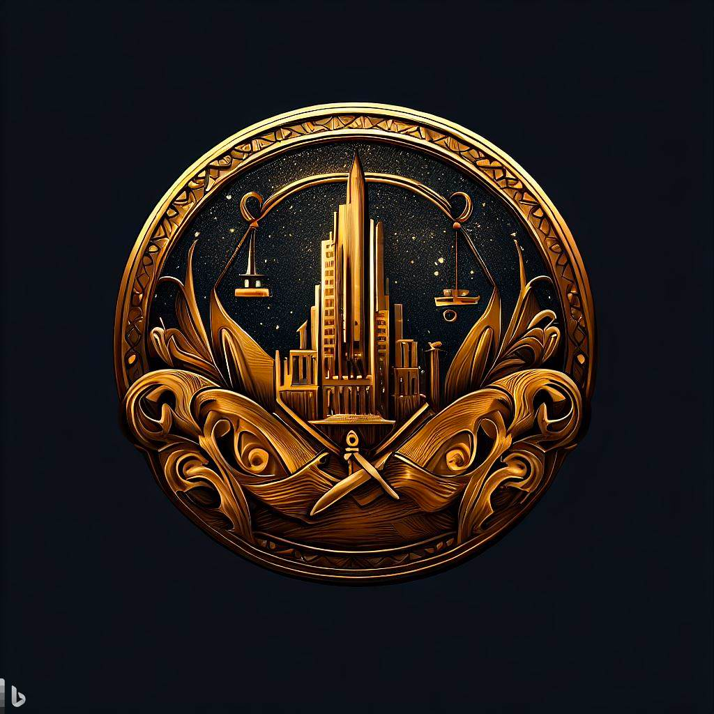

### 律法之城

1. 城邦名：安萨雷斯卡

2. 城邦主体种族：半精灵

3. 城邦首都：安萨，意为理想之城

4. 圣物：法之眼

5. 基座：暗影之塔

   1. 被称为审判之座
   2. 配对罪恶之城的罪恶之链
   3. 现被作为监狱使用

6. 城邦文化：遵纪守法、和平、赏罚分明、民众对统计阶级具有相当高的信任度

7. 城邦政体：

   1. 体制：议会制
   2. 领导人：大法官安格斯
   3. 统治阶层：法官、议员等逐层向下

8. 城邦接壤：力量之城、宗教之城、敬仰之城、腐化之城

9. 地形：律法之城以起伏的丘陵地带为主要地形特征，其间散布着茂密的森林。在城邦的北部地区，还有一片较为平坦的平原，为农业发展提供了良好的条件。

10. 城邦历史：

    1. 第27年：律法之城安萨雷斯卡自信仰之城莫雷森卡萨分离出来，他们原本多是中层神官与虔诚信徒，但他们认为与其信仰规律不如践行和完善规律。信仰之城对于安萨雷斯卡的分裂行为并没有太多表示，他们甚至没有发生圣战讨伐律法之城。这是他们独特的教义所导致。

    2. 第53年：宗教联盟 - 宗教之城和律法之城签订互助条约，加强彼此合作关系。

    3. 第121年：力量之城认为律法之城的法律有损强者的荣誉，并且会促使弱者逐渐增多，因此对律法之城宣战。尽管力量之城恪守荣誉没有采用任何卑劣的战术，但以力量为尊的力量之城仍然远强于和平了很多年的律法之城。这场战斗力量之城一度处于优势，法之塔就是在那时被力量之城夺下的。

    4. 第127年：信仰之城和财富之城介入调停，并通过武力对抗让力量之城认输。力量之城爽快地归还了自己夺得的大部分土地，并在法之塔脚下的港口与安萨雷斯卡签订和平协议。秉着尊重强者的思想，力量之城允许了财富之城和信仰之城在协商港进行贸易活动而免于税务。

    5. 第219年：审判之战 - 律法之城与罪恶之城发生战争，最终律法之城获胜。

    6. 第319年：掠夺远征 - 罪恶之城希望索求一块没有污染的徒弟，因此他们联合偶然联系上却意外合拍的腐化之城发动了一场偷袭

       第320年：四城防线 - 律法之城、力量之城、礼教之城和财富之城联合起来

    7. 第337年：世界大战 - 在四城防线战争演变成全文明联合体的2年后。勇者联盟成功地保卫了这四个城邦的领土，并在战争结束后达成了一项长期的和平协议。这个联盟使得各城邦间的合作关系得以加强，进一步促进了文化、经济和军事方面的交流。

## 下位城邦

1. 审判之城：概念为公正
   1. 位于罪恶之城的西北方向
   2. 接壤罪恶之城和财富之城。
2. 契约之城：概念为诚信
   1. 位于财富之城的西南方向
   2. 接壤财富之城和礼教之城。