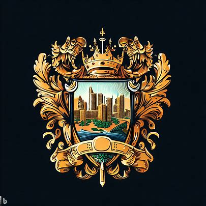

# 礼教之城

1. 城邦名：雅典莱雅
2. 城邦主体种族：精灵
3. 城邦首都：雅典，意为礼仪之城
4. 圣物：礼教之书
5. 基座：力量之塔
   1. 被称为坚固堡垒
   2. 配对力量之城的力量之石
   3. 现被当作军事要塞
6. 城邦文化：礼仪、教育、艺术、传统
7. 城邦政体：
   1. 体制：贵族议会制
   2. 领导人：大公塔拉西亚
   3. 统治阶层：贵族、学者等逐层向下
8. 城邦接壤：信仰之城、财富之城、罪恶之城、神迹之城、探索之城
9. 地形：礼教之城地势起伏较小，主要为平缓的丘陵和广袤的草原。城邦东部则有一片沼泽地带，为野生动植物提供了丰富的生态环境。
10. 城邦历史：
    1. 公元105年，精灵族成立了礼教之城，以礼仪、教育和艺术为核心价值观，强调传统和礼仪在社会中的重要性。
    2. 礼教之城致力于文化交流，吸引了来自世界各地的艺术家、学者和哲学家，使得雅典莱雅逐渐成为文化和学术的中心。
    3. 礼教之城在国际事务中扮演着和事佬的角色，倡导和平与对话。虽然与其他城邦保持友好关系，但礼教之城对罪恶之城的行为持谴责态度，试图通过外交手段遏制罪恶之城的扩张。
    4. 礼教之城是世界上最重视教育的城邦之一，拥有许多著名的学府，吸引了来自世界各地的学生前来求学。
    5. 第157年：智慧之光 - 礼教之城在其图书馆中发现了一部具有重要意义的古籍。
    6. 第319年：勇者联盟 - 力量之城、礼教之城和财富之城共同抵御外敌入侵。
    7. 第319年：掠夺远征 - 罪恶之城希望索求一块没有污染的徒弟，因此他们联合偶然联系上却意外合拍的腐化之城发动了一场偷袭
    8. 第320年：四城防线 - 律法之城、力量之城、礼教之城和财富之城联合起来
    9. 第337年：世界大战 - 在四城防线战争演变成全文明联合体的2年后。勇者联盟成功地保卫了这四个城邦的领土，并在战争结束后达成了一项长期的和平协议。这个联盟使得各城邦间的合作关系得以加强，进一步促进了文化、经济和军事方面的交流。

## 下位城邦

1. 敬仰之城：概念为礼仪
   1. 位于罪恶之城的东南方向
   2. 接壤罪恶之城和律法之城。