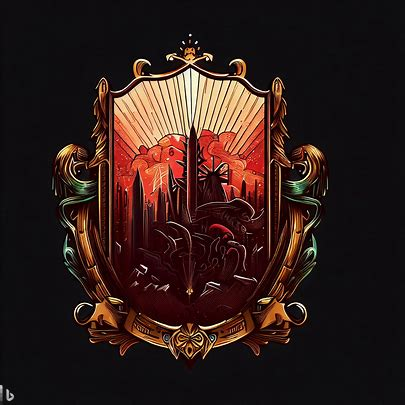

# 罪恶之城

1. 城邦名：莫洛克
2. 城邦主体种族：恶魔
3. 城邦首都：莫洛，意为堕落之地
4. 圣物：罪恶之链
5. 基座：黄金之塔
   1. 被称为黑暗秘境
   2. 配对财富之城的自由之钥
   3. 现被作为贵族宅邸
6. 城邦文化：邪恶、腐化、权谋、犯罪
7. 城邦政体：
   1. 体制：暴政
   2. 领导人：恶魔之王巴尔扎克
   3. 统治阶层：恶魔贵族、军阀等逐层向下
8. 城邦接壤：自由之城、礼教之城、敬仰之城、审判之城
9. 地形：罪恶之城位于一片荒凉的地带，地势较为崎岖，四周有许多险峻的山脉。虽然地形恶劣，但在这片土地上仍然有一些绿洲和河流，为居民提供了生存的基础。
10. 城邦历史：
    1. 公元270年，恶魔创建了罪恶之城，以邪恶、腐化和权谋为核心价值观，建立了暴政统治。
    2. 罪恶之城成为世界上最危险的地区，吸引了无数邪恶势力和犯罪组织，使得莫洛克成为黑暗力量的聚集地。
    3. 在国际事务中，罪恶之城频繁发动侵略战争和颠覆行动，试图扩大自己的势力范围。由于其邪恶行径，罪恶之城与其他城邦的关系紧张，备受警惕和谴责。
    4. 罪恶之城的扩张引发了世界范围内的恐慌，其他城邦不得不联合起来共同对抗罪恶之城，以维护世界和平与稳定。
    5. 第219年：审判之战 - 律法之城与罪恶之城发生战争，最终律法之城获胜。
    6. 第549年：掠夺远征 - 罪恶之城希望索求一块没有污染的徒弟，因此他们联合偶然联系上却意外合拍的腐化之城发动了一场偷袭
    7. 第560年：四城防线 - 律法之城、力量之城、礼教之城和财富之城联合起来
    8. 第587年：世界大战 - 在四城防线战争演变成全文明联合体的2年后。勇者联盟成功地保卫了这四个城邦的领土，并在战争结束后达成了一项长期的和平协议。这个联盟使得各城邦间的合作关系得以加强，进一步促进了文化、经济和军事方面的交流。
    9. 第621年：黑暗盟约 - 罪恶之城与力量之城暗中达成秘密协议，共同谋求利益。

## 下位城邦

1. 腐化之城：概念为堕落
   1. 位于律法之城的东南方向
   2. 接壤律法之城和宗教之城。