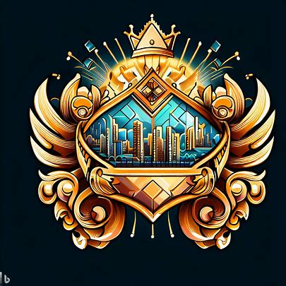

# 财富之城

1. 城邦名：特拉维斯
2. 城邦主体种族：矮人
3. 城邦首都：特维，意为富饶之地
4. 圣物：财富之钥
5. 基座：智慧之塔
   1. 被称为璀璨金塔
   2. 配对礼教之城的礼教之书
   3. 现被用于图书馆
6. 城邦文化：商业、贸易、繁荣、奢侈
7. 城邦政体：
   1. 体制：商人议会制
   2. 领导人：行会首领格兰特
   3. 统治阶层：商人、工匠等逐层向下
8. 城邦接壤：力量之城、礼教之城、自由之城、契约之城、审判之城
9. 地形：财富之城位于河流交汇的地带，河流为这片土地带来了丰富的水源，使得这里的土地肥沃，农业发展迅速。财富之城周边还有一些小山丘，为城市提供了一定程度的屏障。
10. 城邦历史：
    1. 公元50年，矮人创建了财富之城，依托于丰富的资源和矮人的工艺技能，迅速发展成为贸易和商业的重要中心。
    2. 财富之城通过与其他城邦的贸易往来积累了巨大的财富，使得特拉维斯成为世界上最富有的城邦之一。
    3. 公元127年，财富之城和信仰之城共同调停律法之城与力量之城的战争，确保了律法之城的安全。自此以后，财富之城在国际事务中扮演着重要的经济角色，与其他城邦保持良好的贸易往来。
    4. 第193年：繁荣之路 - 财富之城开辟了一条重要的贸易路线，促进了城邦间的经济往来。
    5. 第549年：掠夺远征 - 罪恶之城希望索求一块没有污染的徒弟，因此他们联合偶然联系上却意外合拍的腐化之城发动了一场偷袭
    6. 第560年：四城防线 - 律法之城、力量之城、礼教之城和财富之城联合起来
    7. 第587年：世界大战 - 在四城防线战争演变成全文明联合体的2年后。勇者联盟成功地保卫了这四个城邦的领土，并在战争结束后达成了一项长期的和平协议。这个联盟使得各城邦间的合作关系得以加强，进一步促进了文化、经济和军事方面的交流。

## 下位城邦

1. 繁荣之城：概念为贸易
   1. 位于自由之城的西南方向
   2. 接壤自由之城和宗教之城。